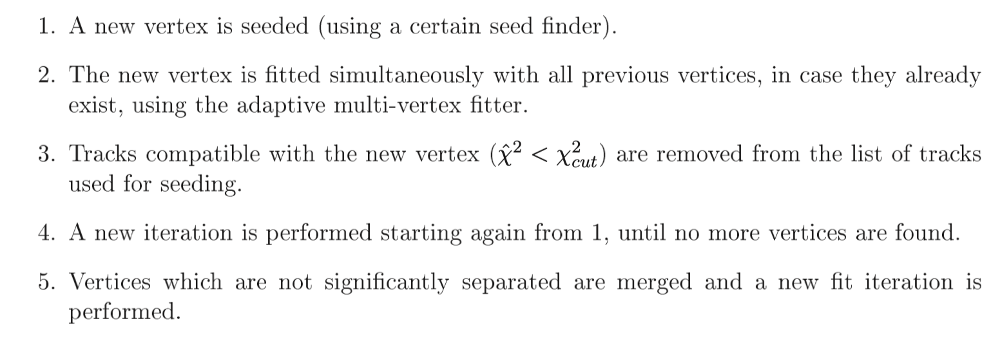

# ACTS-samples

## How to Compile 

The easiest way to do this is using Docker image the Acts team provides. 


``` bash
docker pull ghcr.io/acts-project/ubuntu2004:master

docker run --volume=<source>:/acts:ro --interactive --tty <image> /bin/bash
```
Download the [source code](https://github.com/hrzhao76/acts/tree/Add_Truth_and_Reco_Writer) which is modified to output input tracks for vertexing.  

Inside a Docker container, below is the code to compile Acts. 

```bash 
cmake -B build -S <source> -DACTS_BUILD_EXAMPLES_PYTHIA8=ON
make -j16
```

Otherwise you'll need to meet the prerequisites if you want to compile one a local machine, `a C++17 compiler`, `CMake`, `Boost`, `Eigen` and `Pythia8`.

## How to run Vertex Reconstruction 

The content of the build directory: 

```
|-- ActsConfig.cmake
|-- ActsConfigVersion.cmake
|-- CMakeCache.txt
|-- CMakeFiles
|-- CTestTestfile.cmake
|-- Core
|-- Examples
|-- Fatras
|-- Makefile
|-- Plugins
|-- Tests
|-- bin
|-- cmake_install.cmake
|-- lib
|-- thirdparty
`-- this_acts.sh
```

Navigate to the folder `<cmake_build>/bin`, create a script named `gen_script.sh` containing all the steps, do change the source_dir accordingly. 
``` bash
source_dir=<source>
pu=$1
n_events=$2
mkdir -p logs/log_pu$pu

./ActsExamplePythia8  --rnd-seed=42 --events=$n_events  --output-dir=data/gen/ttbar_mu$pu --output-root --output-csv --gen-cms-energy-gev=14000 --gen-hard-process=Top:qqbar2ttbar=on --gen-npileup=$pu -l 2 | tee logs/log_pu$pu/log.ActsExamplePythia8_pu$pu

./ActsExampleFatrasGeneric --rnd-seed=42 --input-dir=data/gen/ttbar_mu$pu   --output-dir=data/sim_generic/ttbar_mu$pu  --output-csv  --select-eta=-2.5:2.5 --select-pt-gev=0.4: --fatras-pmin-gev 0.4 --remove-neutral  --bf-constant-tesla=0:0:2 -l 2 | tee logs/log_pu$pu/log.ActsExampleFatrasGeneric_pu$pu

./ActsExampleTruthTracksGeneric --rnd-seed=42 --input-dir=data/sim_generic/ttbar_mu$pu --output-dir=data/reco_generic/ttbar_mu$pu --bf-constant-tesla=0:0:2 --digi-config-file $source_dir/Examples/Algorithms/Digitization/share/default-smearing-config-generic.json -l 2 | tee logs/log_pu$pu/log.ActsExampleTruthTracksGeneric_pu$pu


cp data/gen/ttbar_mu$pu/particles.root data/reco_generic/ttbar_mu$pu
./ActsExampleVertexFinderTrackReaderPerformanceWriter  --rnd-seed=42 --bf-constant-tesla=0:0:2 --input-dir=data/reco_generic/ttbar_mu$pu --output-dir=data/vertexing/ttbar_mu$pu -l 2 | tee logs/log_pu$pu/log.ActsExampleVertexFinderTrackReaderPerformanceWriter_pu$pu
```

Then run the code with 
```
./gen_script.sh <n_pu> <n_events>
```

Once you run this and want to re-run the vertexing, only the last command is needed. 

```bash
./ActsExampleVertexFinderTrackReaderPerformanceWriter  --rnd-seed=42 --bf-constant-tesla=0:0:2 --input-dir=data/reco_generic/ttbar_mu$pu --output-dir=data/vertexing/ttbar_mu$pu -l 2 | tee logs/log_pu$pu/log.ActsExampleVertexFinderTrackReaderPerformanceWriter_pu$pu
```

## How AMVF is setup and called

The binary `ActsExampleVertexFinderTrackReaderPerformanceWriter` is directly compiled from [TrackReaderVertexingPerformanceWriterExample.cpp](https://github.com/acts-project/acts/blob/main/Examples/Run/Vertexing/TrackReaderVertexingPerformanceWriterExample.cpp). The core part doing vertexing is L95-L103.  


Then we need to read how AdaptiveMultiVertexFinderAlgorithm is implemented. [ActsExamples::AdaptiveMultiVertexFinderAlgorithm::execute](https://github.com/acts-project/acts/blob/main/Examples/Algorithms/Vertexing/src/AdaptiveMultiVertexFinderAlgorithm.cpp#L56) is the key to execute.  The result is obtained from [finder.find()](https://github.com/acts-project/acts/blob/main/Examples/Algorithms/Vertexing/src/AdaptiveMultiVertexFinderAlgorithm.cpp#L122). 


Fitter is used through the finder. 
L68 - L118 are configurations for this finder. The key is the `find()` function. Check the `find()` function, 
[fitter.addVtxToFit()](https://github.com/acts-project/acts/blob/main/Core/include/Acts/Vertexing/AdaptiveMultiVertexFinder.ipp#L89) is the 

Do a test, add a printout message for each function in fitter. 




## How to setup VSC debug with gdb on docker 

1. start a continer
``` bash
docker run --name acts_debug --security-opt seccomp=unconfined -v <source-code>:/root/ -it ghcr.io/acts-project/ubuntu2004:master
```
2. install `gdb` 
``` bash
# inside the container install gdb and other optional files
apt update && apt upgrade -y
apt install gdb vim cmake build-essential -y 
```
3. Attach your VSC to running container  


4. Install extension to container from VSC extension:   
C++ Extension   
Cmake tools   


5. create configuration files under `<source>` 
- .vscode/c_cpp_properties.json
``` json
{
    "configurations": [
        {
            "name": "Linux",
            "includePath": [
                "${workspaceFolder}/**"
            ],
            "defines": [],
            "compilerPath": "/usr/bin/gcc",
            "cStandard": "gnu17",
            "cppStandard": "gnu++17",
            "intelliSenseMode": "linux-gcc-x64",
            "configurationProvider": "ms-vscode.cmake-tools"
        }
    ],
    "version": 4
}
```

- .vscode/launch.json
``` json
{
    "version": "0.2.0",
    "configurations": [
        {
            "name": "(gdb) Launch",
            "type": "cppdbg",
            "request": "launch",
            // Resolved by CMake Tools:
            "program": "${command:cmake.launchTargetPath}",
            "args": [],
            "stopAtEntry": true,
            "cwd": "${workspaceFolder}",
            "environment": [
                {
                    // add the directory where our target was built to the PATHs
                    // it gets resolved by CMake Tools:
                    "name": "PATH",
                    "value": "${env:PATH}:${command:cmake.getLaunchTargetDirectory}"
                },
                {
                    "name": "OTHER_VALUE",
                    "value": "Something something"
                }
            ],
            "externalConsole": false,
            "MIMode": "gdb",
            "setupCommands": [
                {
                    "description": "Enable pretty-printing for gdb",
                    "text": "-enable-pretty-printing",
                    "ignoreFailures": true
                }
            ]
        }
    ]
}
```

- .vscode/settings.json

``` json
{
    "cmake.configureOnOpen": false,
    "cmake.configureArgs": ["-DACTS_BUILD_EXAMPLES_PYTHIA8=ON"],
    "files.associations": {
        "*.ipp": "cpp",
        "__bit_reference": "cpp",
        "__bits": "cpp",
        "__config": "cpp",
        "__debug": "cpp",
        "__hash_table": "cpp",
        "__locale": "cpp",
        "__mutex_base": "cpp",
        "__node_handle": "cpp",
        "__nullptr": "cpp",
        "__split_buffer": "cpp",
        "__string": "cpp",
        "__threading_support": "cpp",
        "__tree": "cpp",
        "__tuple": "cpp",
        "any": "cpp",
        "array": "cpp",
        "atomic": "cpp",
        "bitset": "cpp",
        "cctype": "cpp",
        "chrono": "cpp",
        "clocale": "cpp",
        "cmath": "cpp",
        "compare": "cpp",
        "complex": "cpp",
        "concepts": "cpp",
        "condition_variable": "cpp",
        "cstdarg": "cpp",
        "cstddef": "cpp",
        "cstdint": "cpp",
        "cstdio": "cpp",
        "cstdlib": "cpp",
        "cstring": "cpp",
        "ctime": "cpp",
        "cwchar": "cpp",
        "cwctype": "cpp",
        "deque": "cpp",
        "exception": "cpp",
        "fstream": "cpp",
        "initializer_list": "cpp",
        "iomanip": "cpp",
        "ios": "cpp",
        "iosfwd": "cpp",
        "iostream": "cpp",
        "istream": "cpp",
        "limits": "cpp",
        "list": "cpp",
        "locale": "cpp",
        "map": "cpp",
        "memory": "cpp",
        "mutex": "cpp",
        "new": "cpp",
        "numeric": "cpp",
        "optional": "cpp",
        "ostream": "cpp",
        "queue": "cpp",
        "random": "cpp",
        "ratio": "cpp",
        "set": "cpp",
        "sstream": "cpp",
        "stack": "cpp",
        "stdexcept": "cpp",
        "streambuf": "cpp",
        "string": "cpp",
        "strstream": "cpp",
        "thread": "cpp",
        "tuple": "cpp",
        "type_traits": "cpp",
        "typeindex": "cpp",
        "typeinfo": "cpp",
        "unordered_map": "cpp",
        "unordered_set": "cpp",
        "variant": "cpp",
        "vector": "cpp",
        "__availability": "cpp",
        "algorithm": "cpp"
    }
}
```
6. build the acts using cmake and select built target to run and debug 